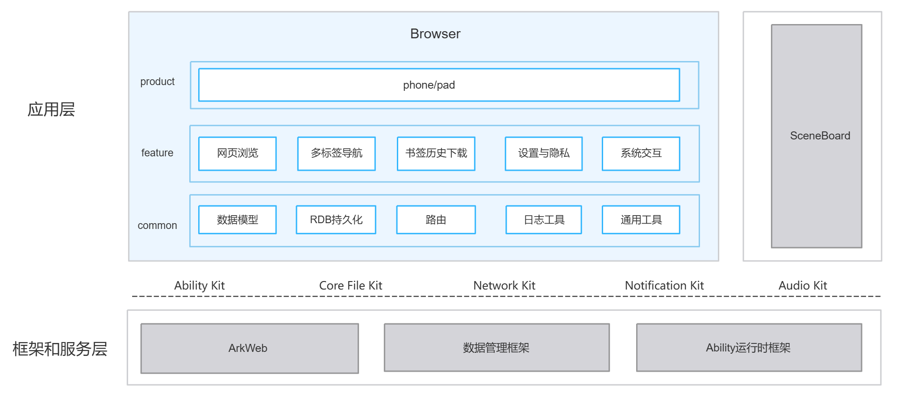

# 浏览器（Browser）

## 简介

**浏览器**（包名：`com.ohos.browser`）是 OpenHarmony 中预置的 **系统应用**，基于 ArkUI 与 ArkWeb 构建，提供主页导航、多标签浏览、书签与历史、下载管理、设置与隐私、系统交互等能力，并适配手机、平板等设备形态。

本应用为系统预置应用，用户可从桌面图标进入；外部应用也可通过 `http` / `https` 的 `viewData` Want 拉起浏览器打开网页。应用窗口、系统栏等与 **SceneBoard** 协同。

### 核心能力

**网页浏览**
- 基于 ArkWeb（WebviewController + 下载委托）加载 HTTPS/HTTP 页面。
- 支持前进、后退、刷新、SSL 证书处理、文本 / 链接 / 图片上下文菜单、图片预览与保存，以及边缘手势返回、页签缩略图快照。

**多标签与导航**
- 支持首页（`MainPage`）、页签管理（`TabsPage`）、浏览页（`BrowsePage`）三页路由。
- 通过 `TabManager` / `BrowserNavigation` 完成标签创建、关闭、恢复与跳转；启动时可恢复上次活跃标签。

**书签、历史与下载**
- **书签**：树形结构（文件夹 + 书签），支持新增、编辑标题/URL、删除（含子节点递归删除）、移动到文件夹、新建文件夹；书签条数上限 100（不含文件夹）；本地 RDB 持久化。
- **历史**：仅记录可浏览的 `http`/`https` 地址；无痕模式不写入；同一站点同一自然日合并为一条（更新访问时间 / 标题 / 图标），跨日新增；搜索词历史最多保留 20 条。
- **下载**：任务队列与进度展示；文件保存到系统 Download 目录，重名自动追加 `(1)`、`(2)`…；图片可写入系统相册。

**设置与隐私**
- 支持搜索引擎切换、站点权限、无痕模式（不写历史与搜索词历史，下载不入列表、不弹通知，退出时清理 Cookie 与站点数据）。
- 支持深色 / 浅色主题，与系统配色、字号联动。

**系统交互**
- 通过 `BrowserWindowService` 与 SceneBoard / Window 协同，支持页面沉浸式浏览。
- 支持外部 Want 打开网页、下载通知拉起、扫码服务依赖等系统能力桥接。

## 与主流浏览器能力对比

对照业界主流桌面与手机浏览器的常见能力，结合本仓当前实现，汇总支持情况如下。  
「支持」指应用侧已落地可用；「不支持」指代码未实现、明确裁剪或仅有引擎能力尚未接产品链路。

| 能力 | 本浏览器 | 描述                                                                                                                                                                                                                  |
|------|---------|---------------------------------------------------------------------------------------------------------------------------------------------------------------------------------------------------------------------|
| HTTP/HTTPS 网页浏览 | 支持 | 基于 ArkWeb（WebviewController）加载与渲染；地址栏自动区分搜索词与 URL（裸域名自动补全 `https://` 前缀），移动端 UA 与 viewport 适配；内置自定义错误页，断网恢复后自动重试加载                                                                                                  |
| 前进 / 后退 / 刷新 | 支持 | 应用自维护全局导航栈，与 ArkWeb 网页历史双向协同：页面到达新 URL 时与栈内前后条目比对，统一决定压栈 / 回退 / 前进索引，保证前进、后退按钮可用态与网页历史一致；后退采用统一决策（优先回退应用栈，栈空后回退网页历史），系统返回键与边缘滑动手势共用同一逻辑；工具栏刷新与停止合一                                                                  |
| 多标签管理 | 支持 | 普通与无痕双分区，每分区上限 100 个标签；普通标签持久化到本地 RDB，无痕标签仅存内存；支持新建 / 关闭 / 切换 / 拖拽排序 / 关闭全部与页面缩略图，启动时恢复上次活跃标签；同一时刻仅活跃标签持有 Web 实例，切换标签按路由重建页面（非活跃标签不保活，切回时重新加载）                                                                      |
| 书签 / 历史 | 支持 | 均存储于本地 RDB：书签为树形结构（文件夹 + 书签，可嵌套；支持新增、编辑、移动、拖拽排序、递归删除子树），书签链接数上限 100（文件夹不计入）；历史仅记录 `http`/`https`，同一站点同一自然日合并为一条记录（更新访问时间 / 标题 / 图标），面板按日期分组，支持按标题 / URL 关键词搜索、单条与批量删除、一键清空                                          |
| 下载管理 | 支持 | 任务队列（最大并发 5，超限排队并在有槽位时自动补位）、进度节流上报与列表展示；文件保存到系统 Download 目录，重名自动追加 `(1)`、`(2)` 后缀，图片可发布到系统相册；所有任务合并为一条统一通知（进度 + 暂停 / 继续），点击通知回跳下载面板；失败分类提示与重试、暂停后按 HTTP Range 断点续传、断网自动暂停 / 网络恢复自动续传，删除任务可连带删除本地文件；无 P2P 下载、限速等高级调度 |
| 无痕模式 | 支持 | 普通 / 无痕标签分区隔离；网页侧以 `incognitoMode` 加载并强制在线缓存模式（不落磁盘缓存）、关闭表单自动填充；不写历史与搜索词历史，下载不入列表、不弹通知（文件仍保存到本地）；关闭最后一个无痕标签或退出应用时，清理 Cookie、站点存储（WebStorage）、定位授权与缓存                                                                |
| 搜索引擎切换与跳转 | 支持 | 内置百度（默认）、Bing、搜狗、360，可在设置中切换；地址栏输入非 URL 内容时，按当前引擎拼装搜索 URL（关键字百分号编码）跳转                                                                                                                                               |
| 页内查找 | 支持 | 基于 ArkWeb `searchAllAsync` 全量高亮匹配并回显命中计数，支持上一个 / 下一个定位与清除高亮                                                                                                                                                         |
| SSL 证书异常确认 | 支持 | 证书异常（过期、域名不匹配、内网自签等）时默认拦截并弹确认框；用户选择「继续访问」后按主机记住信任并持久化，后续访问该主机及其页面子资源不再提示；已信任主机可在设置中管理 / 清除                                                                                                                          |
| 站点权限（定位/相机/麦克风/通知） | 支持 | 与主流浏览器一致，通知类权限授予浏览器后即可用于所有网页，定位、相机、麦克风等敏感权限在浏览器授权后，每个网站仍需授权（默认禁止），无痕模式下默认不授予。                                                                                                                                       |
| 图片预览 / 保存 | 支持 | 长按图片弹出上下文菜单（复制 / 保存），全屏预览支持双指缩放（0.35 倍至 5 倍）；保存经 photoAccessHelper 申请授权后写入系统相册                                                                                                                                     |
| PDF / JSON / XML / TXT 预览 | 支持 | 由 ArkWeb 内置渲染能力直接预览；外部 `file://` / `datashare://` 文件先复制到应用沙箱再加载；已注册 `file` 打开能力（FileOpen），覆盖 PDF、HTML、纯文本、Markdown、JSON、XML、CSV 等类型                                                                                 |
| 扫码打开网页 | 支持 | 拉起系统扫码服务（`com.ohos.scanservice`，支持相册选图与多码识别，扫码类型为二维码），结果为 `http`/`https` 地址时直接打开，否则按 URL 规则尝试补全                                                                                                                     |
| 外链 Want 打开网页 | 支持 | 以 `entity.system.browsable` + `viewData` 注册 `http`/`https` 外链拉起；运行时仅接受 `http`/`https` 及可预览的本地文件 URI，其余 scheme 忽略                                                                                                    |
| 深色模式 / 系统字号 | 支持 | 主题支持跟随系统 / 浅色 / 深色，由系统配色同步；网页侧 darkMode + forceDarkAccess 强制深色，切换主题自动重载页面；字号支持跟随系统（监听系统字号变化实时联动）或三档手动档位（85% / 100% / 115%），经 textZoomRatio + JS 注入兜底生效                                                              |
| 网页内音视频播放 | 支持 | ArkWeb HTML5 媒体页内播放；进入全屏时自动隐藏地址栏与工具栏、退出恢复；未自定义自动播放策略，跟随 ArkWeb 默认                                                                                                                                                   |
| HTTP / SOCKS 代理 | 不支持 | 无代理设置 UI 与应用内配置 API                                                                                                                                                                                                 |
| 扩展 / 插件生态 | 不支持 | 无扩展框架与管理 UI；产品定位为系统基础浏览器                                                                                                                                                                                            |
| 账号同步（书签/历史/密码上云） | 不支持 | 仅本地 RDB 存储，无账号体系与云端同步                                                                                                                                                                                               |
| 密码管理 / 自动填充 | 不支持 | 未接入系统密码保险箱（无密码保存 / 同步）；仅启用 ArkWeb 内置表单自动填充（无痕下关闭）                                                                                                                                                                   |
| 翻译 / 阅读模式 | 不支持 | 未接入翻译或阅读模式服务                                                                                                                                                                                                        |
| 广告拦截 / 高级跟踪防护 | 不支持 | 无规则引擎与跟踪防护；仅有站点权限、无痕模式与设置中的无图模式                                                                                                                                                                                     |
| 开发者工具 | 不支持 | 未开启 webDebuggingAccess，无网页调试 / 检查界面                                                                                                                                                                                 |
| 打印网页 | 不支持 | 打印依赖系统打印框架，当前系统不具备                                                                                                                                                                                                  |
| 网页视频接入播控中心| 不支持 | 网页视频依赖ArkWeb实现的流媒体播放，没有接入AVSession，不支持播控中心                                                                                                                                                                          |
| 服务端搜索建议 | 不支持 | 仅本地历史 / 书签匹配，未接搜索引擎建议接口                                                                                                                                                                                             |
| 恶意网址拦截 | 不支持 | 未接入恶意网址拦截服务                                                                                                                                                                                                         |
| 多进程渲染隔离 | 不支持 | 单主进程 + 进程内 ArkWeb，所有标签共用同一渲染进程，不隔离到独立 OS 进程；未配置 multiProcess 多进程模式                                                                                                                                                  |

## 架构说明

浏览器采用分层与模块化设计，按产品形态、业务特性与公共能力组织代码，并与 SceneBoard 等系统能力协同，如图：


### 应用层分层设计

整体可划分为产品层、特性层、公共层：

| 层次 | 主要目录 / 组件 | 说明 |
|------| -------------- |------|
| 产品层 | `product/entry` | 支持手机、平板等形态入口；Ability、页面壳、权限与资源 |
| 特性层 | `feature/browser_core`、`feature/home`、`feature/tab`、`feature/web`、`feature/bookmark`、`feature/download`、`feature/settings`、`feature/security`、`feature/commons` | 网页浏览、多标签导航、书签历史下载、设置隐私、系统交互 |
| 公共层 | `common` | 数据模型、RDB 持久化、路由桥、日志与通用工具 |

**特性层模块说明**：

| 核心能力 | 主要模块与关键类 | 说明 |
|---------|----------------|------|
| 网页浏览 | `feature/web`、`feature/browser_core/web/`<br>BrowsePageView / WebBrowseViewModel / WebPageController | <ul><li>基于 ArkWeb 的页面加载与渲染</li><li>地址栏搜索词与 URL 判定、UA 与 viewport 适配</li><li>前进 / 后退 / 刷新（应用导航栈与 Web 历史协同）</li><li>页内查找</li><li>链接 / 图片上下文菜单与全屏图片预览（双指缩放 0.35 倍至 5 倍）</li><li>自定义错误页与断网重试</li><li>页内音视频播放与全屏</li></ul> |
| 多标签导航 | `feature/tab`、`feature/home`、`feature/browser_core/tab/`、`navigation/`<br>TabsPageView / TabManagementViewModel / HomeView / SearchViewModel / TabManager / BrowserNavigation / NavigationController | <ul><li>普通与无痕双分区标签管理（创建 / 关闭 / 切换 / 拖拽排序 / 关闭全部，每分区上限 100；普通标签 RDB 持久化，无痕仅内存）</li><li>首页 / 页签管理页 / 浏览页路由</li><li>启动恢复上次活跃标签</li><li>系统返回键与边缘手势的统一后退决策</li></ul> |
| 书签历史下载 | `feature/bookmark`、`feature/download`、`feature/browser_core/download_svc/`、`common/repository/`<br>BookmarksPanel / HistoryPanel / DownloadsPanel / DownloadManager / DownloadNotificationService / BookmarkRepository / HistoryRepository | <ul><li>书签树形 CRUD（新增 / 编辑 / 移动 / 建文件夹 / 递归删除，书签上限 100）</li><li>历史按站点 + 自然日合并、按日期分组、关键词搜索与删除清空</li><li>下载任务队列（最大并发 5）、进度节流与统一通知</li><li>暂停 / 重试 / HTTP Range 断点续传、系统 Download 目录落盘与相册发布</li></ul> |
| 设置与隐私 | `feature/settings`、`feature/security`、`feature/bookmark`、`feature/browser_core/security/`、`settings/`、`web/WebPermissionGate.ets`<br>ProfileView / SecurityPrivacyViewModel / FeaturePanel / BrowseSettingsSection / SslHandler / IncognitoPolicy / IncognitoWebDataCleaner | <ul><li>主题与系统字号联动</li><li>搜索引擎切换（百度 / Bing / 搜狗 / 360）</li><li>站点权限两层授权（应用级系统权限 + 按来源持久化的站点策略，默认禁止；通知为系统级开关）</li><li>SSL 证书异常确认与已信任主机管理</li><li>无痕策略（不写历史 / 搜索词历史，下载不入列表，退出清理 Cookie、站点存储与定位授权）</li></ul> |
| 系统交互 | `feature/browser_core/settings/`（BrowserWindowService）、`navigation/`（ScanQrService）、`download_svc/`（ShareService）、`system/`（ImageGalleryService / ShareAppAvailability）、`product/entry`（MainAbility） | <ul><li>与 SceneBoard / 窗口 / 系统栏协同（含沉浸式浏览与侧滑返回）</li><li>外部 Want 拉起打开网页（`http`/`https` 外链与 `file` 本地文件预览）</li><li>扫码打开网页</li><li>下载完成通知回跳下载面板</li><li>图库写入与系统分享桥接</li></ul> |

### 与外部应用的关系

| 项目 | 说明 |
|------|------|
| 是否允许外部应用调用 | 允许。MainAbility 声明 `exported=true`，外部应用可通过 Want 拉起 |
| 谁能调用 | 应用可通过 `entity.system.browsable` + `http`/`https` URI 拉起 |
| 什么时候能调用 | 应用安装后即可调用；访问定位 / 相机 / 麦克风等站点能力时需用户授权 |
| 支持的 Want 参数 | 桌面入口：`ohos.want.action.home`；外链浏览：`ohos.want.action.viewData`，`uri` 为待打开的 `http`/`https` 地址 |
| 与 SceneBoard 的关系 | 依赖 SceneBoard 承接桌面入口与窗口场景；`BrowserWindowService` 在前后台切换时与 SceneBoard / SystemUI 协同系统栏与安全区 |
| 跨进程依赖 | 扫码依赖 `com.ohos.scanservice`（`module.json5` dependencies）；网页渲染依赖 ArkWeb |

## 编译构建

本工程为多模块 HAP 应用工程，使用 Hvigor 构建，产物为 `com.ohos.browser` 系统应用包。

### 环境要求
- OpenHarmony SDK（本工程 compileSdkVersion 为 "26.0.0"，compatibleSdkVersion和targetSdkVersion 为 23）
- DevEco Studio 或命令行 Hvigor 工具链
- 系统签名证书（见 `signature/`）

### 编译命令

在工程根目录执行：

```bash
# 使用 DevEco Studio 打开工程后执行 Build，或使用 hvigor 命令行
hvigorw assembleHap
```

## 浏览器开发

浏览器采用 **ArkTS** 语言开发，UI 基于 ArkUI Stage 模型。应用通过 `MainAbility` 承载主界面，通过 `feature/*` 完成浏览业务，并通过 `common` 保持模型与数据库一致。开发可参考：[ArkUI 开发概述](https://gitcode.com/openharmony/docs/blob/master/zh-cn/application-dev/ui/arkts-ui-development-overview.md)、[ArkWeb 开发指南](https://gitcode.com/openharmony/docs/tree/master/zh-cn/application-dev/web)。

### 基于已有模块的开发

适用场景：对已有能力做功能定制，例如调整首页快捷方式、扩展下载确认流、修改系统栏协同、裁剪某 Feature 等。

**对已有模块的功能修改与裁剪**

1. 明确改动点：按业务边界定位到 `product/entry`（入口与页面壳）、`feature/web`（浏览 UI）、`feature/browser_core`（门面与服务）、`feature/bookmark` / `download`（书签下载）或 `common`（公共能力）。
2. 修改浏览链路：
   - 页面壳位于 `product/entry/src/main/ets/pages/BrowsePage.ets`
   - 浏览 UI 位于 `feature/web/src/main/ets/BrowsePageView.ets`
   - Web 控制位于 `feature/browser_core/src/main/ets/web/WebPageController.ets`

    例如，入口 Ability 在窗口创建时加载主页面并延迟初始化 WebEngine：
    ```typescript
    // MainAbility.ets — onWindowStageCreate 是主窗口入口
    onWindowStageCreate(windowStage: window.WindowStage): void {
      BrowserWindowService.getInstance().attachStage(windowStage, this.context);
      windowStage.loadContent('pages/MainPage', (err) => {
        if (err.code) {
          return;
        }
        BrowserWindowService.getInstance().onContentLoaded();
        setTimeout(() => {
          webview.WebviewController.initializeWebEngine();
          webview.WebviewController.enableWholeWebPageDrawing();
        }, 0);
      });
    }
    ```
3. 修改标签 / 路由：
   - 标签管理位于 `feature/browser_core/src/main/ets/tab/TabManager.ets`
   - 页面跳转位于 `feature/browser_core/src/main/ets/BrowserNavigation.ets`
4. 修改系统交互 / SceneBoard 协同：
   - 窗口与系统栏位于 `feature/browser_core/src/main/ets/settings/BrowserWindowService.ets`
   - 外链 Want 解析位于 `product/entry/src/main/ets/MainAbility/MainAbility.ets`
5. 修改 UI 组件：
   - 首页、浏览、书签等 UI 位于对应 `feature/*/src/main/ets/`
   - 通用对话框、Toast 等位于 `feature/commons/`

常用修改入口：

| 目标 | 路径 |
|------|------|
| 应用入口 Ability | `product/entry/src/main/ets/MainAbility/MainAbility.ets` |
| 首页 / 管理页壳 | `product/entry/src/main/ets/pages/MainPage.ets` |
| 浏览页 | `feature/web/src/main/ets/BrowsePageView.ets` |
| UI 门面 | `feature/browser_core/src/main/ets/BrowserStore.ets` |
| 窗口 / SceneBoard 协同 | `feature/browser_core/src/main/ets/settings/BrowserWindowService.ets` |
| 模型与 RDB | `common/src/main/ets/model/`、`common/src/main/ets/repository/` |

### 新特性能力的开发

适用场景：新增全屏路由页、扩展浏览相关能力、补充系统交互或适配新设备形态。下面以 **「新增导航页面」** 为例说明端到端步骤（可类比新增设置子页、独立工具页等）。

> **说明**：当前工程采用 `product + feature + common` 多模块结构，产品入口主要在 `product/entry`。新能力一般按现有分层扩展；若新增产品形态 HAP，可在 `product/` 下增加对应目录并在 `build-profile.json5` 中注册。

**示例：新增导航页面（如 `NavGuidePage`）**

1. **在 Feature 中实现页面 UI / ViewModel**  
   例如在 `feature/home`（或新建 `feature/nav`）下新增：
   - `src/main/ets/NavGuidePageView.ets`：页面布局与交互  
   - `src/main/ets/NavGuideViewModel.ets`：状态与业务逻辑  
   若需持久化（如引导完成标记），在 `common/src/main/ets/model/` 与 `repository/` 扩展字段，并由 `SettingsStore` / Repository 读写。

2. **在产品层增加路由页面壳并注册**  
   - 新增 `product/entry/src/main/ets/pages/NavGuidePage.ets`，内部组合 Feature 中的 View。  
   - 在 `product/entry/src/main/resources/base/profile/main_pages.json` 中声明页面路径（与现有 `MainPage` / `BrowsePage` / `TabsPage` 同级）。

3. **在导航层增加跳转入口**  
   - 在 `feature/browser_core/src/main/ets/BrowserNavigation.ets` 增加打开方法（例如 `openNavGuide()`），内部通过路由桥 `pushUrl` 到 `pages/NavGuidePage`。  
   - 在触发点（首页按钮、`BrowserStore` 门面或 Want 参数）调用该方法。  
   - 如需从页签管理返回时恢复正确分区，参考现有 `openTabs` / `returnFromTabsManager` 对 `incognito` 参数的处理。

4. **确认 Ability / 权限 / 依赖**  
   入口 Ability 已在 `product/entry/src/main/module.json5` 声明；新页面通常只需确认：是否新增权限、是否新增 skills、是否依赖新的 HAR（在 `build-profile.json5` 与 `product/entry/oh-package.json5` 注册）。

```json
{
  "module": {
    "name": "entry",
    "type": "entry",
    "mainElement": "MainAbility",
    "deviceTypes": [
      "default",
      "tablet"
    ],
    "abilities": [
      {
        "name": "MainAbility",
        "srcEntry": "./ets/MainAbility/MainAbility.ets",
        "exported": true
      }
    ]
  }
}
```

5. **联调验证**  
   冷启动进入、从首页/浏览页跳转、系统返回键 / 边缘返回、横竖屏与系统栏（`BrowserWindowService`）、无痕分区切换等场景均需覆盖。

**其余常见扩展**（步骤与上类似，落点不同）：
- 扩展书签能力：改 `feature/bookmark` + `BookmarkRepository`，注意 `BOOKMARK_LIMIT`。  
- 扩展下载确认流：改 `feature/download` + `DownloadManager`。  
- 扩展站点权限项：改 `WebPermissionGate` + 设置页 UI。

## 目录

工程按「产品入口 / 特性模块 / 公共能力」三层组织。

```text
applications_browser
├─AppScope                                      # 应用级配置：包名、版本、全局文案与图标等
│  ├─app.json5                                  # 应用标识与版本信息
│  └─resources/                                 # 多语言字符串、图标等全局资源
├─common                                        # 公共能力：多特性共用的数据与工具
│  └─src/main/ets/
│     ├─model/                                  # 书签、历史、下载、标签等数据模型与上限常量
│     ├─repository/                             # 本地数据库访问：书签 / 历史 / 下载 / 标签 / 设置
│     └─utils/                                  # 日志、页面跳转桥接、通用工具与文案组装
├─feature                                       # 特性层：按业务拆分的功能模块
│  ├─browser_core/                              # 浏览核心：对外门面、导航与各类后台服务
│  │  └─src/main/ets/
│  │     ├─BrowserStore.ets / BrowserNavigation.ets / BrowserApp.ets   # 统一状态门面、页面跳转、应用启动初始化
│  │     ├─tab/                                 # 多标签：创建 / 关闭 / 切换 / 排序、缩略图
│  │     ├─web/                                 # 网页控制：加载控制、站点权限判定
│  │     ├─download_svc/                        # 下载服务：任务队列、进度、通知、落盘路径
│  │     ├─security/                            # 安全隐私：证书异常确认、无痕写入拦截
│  │     ├─settings/                            # 设置与窗口：偏好存储、系统栏 / 沉浸式协同
│  │     ├─navigation/                          # 导航辅助：扫码打开网页、路由控制
│  │     └─system/                              # 系统能力桥接：图库写入、分享可用性等
│  ├─commons/                                   # 通用界面零件：对话框、图标、提示等
│  ├─home/                                      # 首页：搜索入口、快捷方式
│  ├─tab/                                       # 标签管理页界面
│  ├─web/                                       # 浏览页界面：网页展示与操作栏
│  ├─bookmark/                                  # 书签与历史面板：增删改查、按日分组
│  ├─download/                                  # 下载列表界面：进度展示与任务操作
│  ├─settings/                                  # 管理 / 设置页界面：引擎、权限、主题等
│  └─security/                                  # 安全隐私相关界面
├─product                                       # 产品层：可安装的应用入口
│  └─entry/                                     # 入口包：Ability、页面壳、权限声明
│     └─src/main/
│        ├─ets/
│        │  ├─MainAbility/                      # 应用入口生命周期、备份扩展
│        │  └─pages/                            # 首页 / 浏览页 / 标签页等页面壳
│        ├─module.json5                         # 权限、入口组件、技能与跨应用依赖
│        └─resources/                           # 页面注册、字符串与图标资源
├─docs/figures/                                 # 文档插图：架构示意图等
├─lib/                                          # 本地依赖库
├─hvigor/                                       # 构建工具配置
├─signature/                                    # 签名证书与签名配置
├─build-profile.json5                           # 工程级配置
├─oh-package.json5                              # 包依赖声明
├─README.md                                     # 中文说明文档
└─README_en.md                                  # 英文说明文档
```

## 约束
- **语言版本**：ArkTS
- **运行形态**：系统预置应用（`com.ohos.browser`），依赖 ArkWeb、网络、文件、媒体库、SceneBoard / 窗口等系统能力
- **设备类型**：入口模块 `deviceTypes` 与各 Feature HAR 均声明为 `default`、`tablet`
- **权限**：浏览器所需的主要权限如下（见 `product/entry/src/main/module.json5`）。注意：这里列的是给**浏览器应用**的系统权限；网页要用定位 / 相机 / 麦克风等，还须按站点再申请，详见上文「网页权限」。

  | 权限 | 授权方式 | 使用场景 |
  |------|---------|--------|
  | ohos.permission.INTERNET | 系统授权 | 网页访问 |
  | ohos.permission.GET_NETWORK_INFO | 系统授权 | 网络状态感知（如下载） |
  | ohos.permission.WRITE_IMAGEVIDEO | 用户授权 | 图片保存到相册 |
  | ohos.permission.READ_WRITE_DOWNLOAD_DIRECTORY | 用户授权 | 下载文件写入系统 Download 目录 |
  | ohos.permission.APPROXIMATELY_LOCATION / LOCATION | 用户授权 | 先给浏览器定位能力；具体网页还要再申请 |
  | ohos.permission.CAMERA | 用户授权 | 先给浏览器相机能力；具体网页还要再申请 |
  | ohos.permission.MICROPHONE | 用户授权 | 先给浏览器麦克风能力；具体网页还要再申请 |

- **系统协同**：窗口与系统栏行为依赖 SceneBoard / SystemUI；修改 `BrowserWindowService` 时需验证冷启动、回前台、多任务切换等场景

## 参与贡献

欢迎广大开发者贡献代码、文档等，具体的贡献流程和方式请参见[参与贡献](https://gitcode.com/openharmony/docs/blob/master/zh-cn/contribute/%E5%8F%82%E4%B8%8E%E8%B4%A1%E7%8C%AE.md)。
