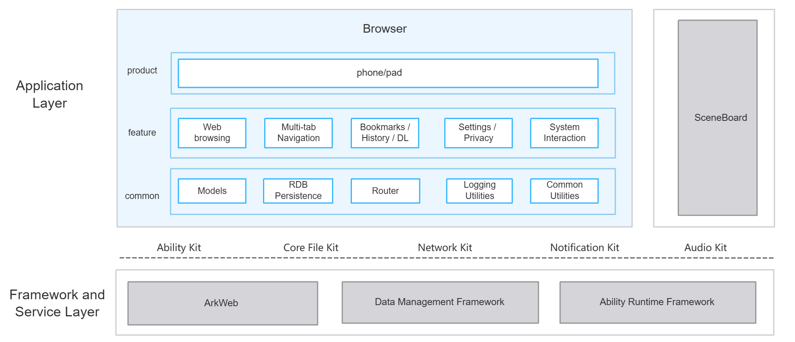

# Browser

## Introduction

**Browser** (bundle name: `com.ohos.browser`) is a pre-installed **system application** in OpenHarmony. Built with ArkUI and ArkWeb, it provides home navigation, multi-tab browsing, bookmarks and history, download management, settings and privacy, and system interaction capabilities, and adapts to phone and pad form factors.

This application is a system preset app. Users can open it from the desktop icon; external apps can also launch it via `http` / `https` `viewData` Want to open web pages. Window and system-bar behavior coordinates with **SceneBoard**.

### Core Capabilities

**Web browsing**
- Loads HTTPS/HTTP pages via ArkWeb (WebviewController + download delegate).
- Supports back, forward, refresh, SSL certificate handling, text / link / image context menus, image preview / save, edge gesture back, and tab thumbnail snapshots.

**Multi-tab and Navigation**
- Supports three routed pages: home (`MainPage`), tab manager (`TabsPage`), and browse (`BrowsePage`).
- Uses `TabManager` / `BrowserNavigation` for tab create, close, restore, and routing; can restore the last active tab on launch.

**Bookmarks, History, and Downloads**
- **Bookmarks**: tree structure (folders + items); create, edit title/URL, delete (recursive for children), move to folder, create folder; bookmark count cap 100 (folders excluded); local RDB persistence.
- **History**: only recordable `http`/`https` URLs; skipped in incognito; same site on the same calendar day merges into one entry (updates visit time / title / icon), new day creates a new row; search-keyword history keeps at most 20 items.
- **Downloads**: queue and progress UI; files go to the system Download directory with automatic `(1)`, `(2)`, … suffixes; images can be published to the system gallery.

**Settings and Privacy**
- Supports search-engine switching, site permissions, and incognito mode (no history / search-keyword history; downloads stay out of the list and produce no notification; cookies and site data cleared on exit).
- Supports light / dark theme synced with system color mode and font size.

**System Interaction**
- Through collaboration between `BrowserWindowService` and SceneBoard / Window, the browser supports immersive page browsing.
- Bridges system capabilities such as external Want open, download notification launch, and scan-service dependency.

## Comparison with Mainstream Browsers

The table below compares common capabilities of mainstream desktop and mobile browsers with this repository’s current implementation.  
“Supported” means the app has a usable product path; “Not supported” means not implemented, explicitly trimmed, or engine-only without an app integration path.

| Capability | This browser | Description |
|------------|--------------|-------------|
| HTTP/HTTPS browsing | Supported | Loads and renders pages through ArkWeb (WebviewController). The address bar distinguishes search keywords from URLs (bare domains get an automatic `https://` prefix), with mobile UA and viewport adaptation; custom error page with automatic reload retry after offline recovery |
| Back / forward / refresh | Supported | A global app-level navigation stack stays in sync with the ArkWeb page history: when a page lands on a new URL, it is compared with the adjacent stack entries to decide push / step-back / step-forward, keeping the back and forward button states consistent with the web history. Back navigation uses a unified decision flow (app stack first, then web history), shared by the system back key and the edge swipe gesture; the toolbar refresh and stop actions are combined |
| Multi-tab management | Supported | Normal and incognito partitions, each capped at 100 tabs; normal tabs are persisted to the local RDB while incognito tabs stay in memory only. Supports create / close / switch / drag-reorder / close-all and page thumbnails, and restores the last active tab on launch. Only the active tab holds a live Web instance at a time — switching tabs rebuilds the browse page via routing (inactive tabs are not kept alive; returning to one reloads its URL). Multi-process render isolation is not enabled (see the row below) |
| Bookmarks / history | Supported | Both stored in the local RDB. Bookmarks form a tree (folders + items, nestable; add, edit, move, drag-reorder, recursive delete of subtrees), with a bookmark-link cap of 100 (folders excluded). History records `http`/`https` only; same site on the same calendar day merges into one entry (visit time / title / icon updated), grouped by date in the panel, with title / URL keyword search, single & batch delete, and clear all |
| Downloads | Supported | Task queue (max 5 concurrent; excess tasks are queued and auto-promoted as slots free up), throttled progress reporting and list UI. Files go to the system Download directory with automatic `(1)`, `(2)` … suffixes on name conflict, and images can be published to the system gallery. All tasks share one unified notification (progress + pause / resume) that deep-links back to the download panel on tap. Failure classification and retry, HTTP Range resume after pause, auto-pause when offline / auto-resume when the network recovers; deleting a task can also delete the local file. No P2P download, speed limiting, or other advanced scheduling |
| Incognito | Supported | Normal / incognito tab partitions. Pages load with ArkWeb `incognitoMode` and forced online cache mode (no disk cache), with form autofill disabled. History and search-keyword history are not written; downloads are kept out of the list and produce no notification (files are still saved locally). Closing the last incognito tab or exiting the app clears cookies, WebStorage data, geolocation grants, and cache |
| Search engine switch & navigate | Supported | Built-in Baidu (default), Bing, Sogou, and 360, switchable in settings. When the address-bar input is not a URL, it is sent to the current engine as a percent-encoded search query |
| Find in page | Supported | Uses ArkWeb `searchAllAsync` to highlight all matches and report the hit count, with previous / next stepping and clear-highlight support |
| SSL error confirmation | Supported | Certificate problems (expired, host mismatch, intranet self-signed, etc.) are blocked by default with a confirmation dialog. Choosing “continue” stores the trust per host (persisted), so later visits to that host and its page subresources are no longer prompted; trusted hosts can be managed / cleared in settings |
| Site permissions (location/camera/mic/notification) | Supported | Same idea as mainstream browsers: notification granted to the browser can be used for all pages; after the browser is granted location / camera / microphone, each site must still be allowed (denied by default); denied by default in incognito |
| Image preview / save | Supported | Long-press an image for a context menu (copy / save) and a pinch-zoom fullscreen preview (0.35× to 5×). Saving writes to the system gallery via photoAccessHelper after a permission request |
| PDF / JSON / XML / TXT preview | Supported | Previewed by ArkWeb built-in rendering; external `file://` / `datashare://` files are first copied into the app sandbox and then loaded. A `file` open capability (FileOpen) is registered, covering PDF, HTML, plain text, Markdown, JSON, XML, CSV, and more |
| Scan QR to open URL | Supported | Launches the system scan service (`com.ohos.scanservice`, supports picking from the gallery and multi-code scanning; scan type is QR). An `http`/`https` result opens directly; otherwise the result is completed into a URL when possible |
| External Want to open pages | Supported | Registered for `http`/`https` launches via `entity.system.browsable` + `viewData`. At runtime only `http`/`https` and previewable local-file URIs are accepted; other schemes are ignored |
| Dark mode / system font scale | Supported | Theme preference: follow system / light / dark, synced from the system color mode; pages use darkMode + forceDarkAccess and are reloaded on theme change. Font scale: follow system (live-synced by observing the system font-scale setting) or three manual levels (85% / 100% / 115%), applied via textZoomRatio with a JS-injection fallback |
| In-page audio/video playback | Supported | ArkWeb HTML5 media plays in-page. Entering fullscreen hides the address bar and toolbar, and they are restored on exit. No custom autoplay policy — the ArkWeb default applies |
| HTTP / SOCKS proxy | Not supported | No proxy settings UI or in-app configuration API |
| Extensions / plugins | Not supported | No extension framework or management UI; positioned as a system basic browser |
| Account sync (bookmarks/history/passwords) | Not supported | Local RDB storage only; no account system or cloud sync |
| Password manager / autofill | Not supported | No system password vault integration (no password save / sync); only ArkWeb built-in form autofill is enabled (disabled in incognito) |
| Translate / reader mode | Not supported | No translation or reader-mode service |
| Ad block / advanced tracking protection | Not supported | No rule engine or tracking protection; only site permissions, incognito, and the image-less mode in settings |
| Developer tools | Not supported | webDebuggingAccess is not enabled; no page inspect / debug UI |
| Print page | Not supported | Printing depends on the system print framework, which is not available on the current system |
| Web media in system media session | Not supported | Web video relies on ArkWeb streaming-media playback and is not integrated with AVSession, so the media control center is not supported |
| Server-side search suggestions | Not supported | Local history / bookmark match only; no search-suggestion API |
| Malicious URL blocking | Not supported | No malicious-URL blocking service |
| Multi-process render isolation | Not supported | Single main process + in-process ArkWeb: all tabs share one render process and are not isolated into separate OS processes; the multiProcess mode is not configured |

## Architecture

Browser uses a layered and modular design organized by product form, business features, and common capabilities, and collaborates with SceneBoard and related system capabilities, as shown below:


### Application Layered Design

The overall structure is divided into product, feature, and common layers:

| Layer | Main Directories / Components | Description |
|------| ----------------------------- |-------------|
| Product | `product/entry` | Phone / Pad entry HAP; Ability, page shells, permissions, and resources |
| Feature | `feature/browser_core`, `feature/home`, `feature/tab`, `feature/web`, `feature/bookmark`, `feature/download`, `feature/settings`, `feature/security`, `feature/commons` | Browsing, tabs/navigation, bookmarks/history/downloads, settings/privacy, system interaction |
| Common | `common` | Models, RDB persistence, router bridge, logging, and utilities |

**Feature module description**:

| Capability | Main modules & key classes | Description |
|------------|---------------------------|-------------|
| Web browsing | `feature/web`, `feature/browser_core/web/`<br>BrowsePageView / WebBrowseViewModel / WebPageController | <ul><li>ArkWeb-based page load and render</li><li>Address-bar keyword vs URL detection, UA and viewport adaptation</li><li>Back / forward / refresh (app navigation stack synced with the web history)</li><li>Find in page</li><li>Link / image context menus and pinch-zoom fullscreen image preview (0.35× to 5×)</li><li>Custom error page with offline retry</li><li>In-page audio/video playback and fullscreen</li></ul> |
| Tabs / navigation | `feature/tab`, `feature/home`, `feature/browser_core/tab/`, `navigation/`<br>TabsPageView / TabManagementViewModel / HomeView / SearchViewModel / TabManager / BrowserNavigation / NavigationController | <ul><li>Normal and incognito tab partitions (create / close / switch / drag-reorder / close-all, each capped at 100; normal tabs persisted in RDB, incognito in memory only)</li><li>Home / tabs-manager / browse routing</li><li>Restores the last active tab on launch</li><li>Unified back decision for the system back key and edge swipe</li></ul> |
| Bookmarks / history / downloads | `feature/bookmark`, `feature/download`, `feature/browser_core/download_svc/`, `common/repository/`<br>BookmarksPanel / HistoryPanel / DownloadsPanel / DownloadManager / DownloadNotificationService / BookmarkRepository / HistoryRepository | <ul><li>Bookmark tree CRUD (add / edit / move / create folder / recursive delete; bookmark cap 100)</li><li>History merged by site + calendar day, grouped by date, keyword search, delete and clear</li><li>Download task queue (max 5 concurrent), throttled progress and unified notification</li><li>Pause / retry / HTTP Range resume; files to the system Download directory and gallery publishing</li></ul> |
| Settings / privacy | `feature/settings`, `feature/security`, `feature/bookmark`, `feature/browser_core/security/`, `settings/`, `web/WebPermissionGate.ets`<br>ProfileView / SecurityPrivacyViewModel / FeaturePanel / BrowseSettingsSection / SslHandler / IncognitoPolicy / IncognitoWebDataCleaner | <ul><li>Theme and system font-scale sync</li><li>Search-engine switch (Baidu / Bing / Sogou / 360)</li><li>Two-layer site permissions (app-level system permission + persisted per-origin site policy, denied by default; notification is a system-level switch)</li><li>SSL error confirmation and trusted-host management</li><li>Incognito policy (no history / search-keyword history; downloads kept out of the list; cookies, site storage, and geolocation grants cleared on exit)</li></ul> |
| System interaction | `feature/browser_core/settings/` (BrowserWindowService), `navigation/` (ScanQrService), `download_svc/` (ShareService), `system/` (ImageGalleryService / ShareAppAvailability), `product/entry` (MainAbility) | <ul><li>SceneBoard / window / system-bar coordination (immersive browsing and edge-swipe back)</li><li>External Want launch (`http`/`https` links and `file` local-file preview)</li><li>Scan QR to open a URL</li><li>Download-complete notification deep-link back to the download panel</li><li>Gallery write and system-share bridges</li></ul> |

### Relationship with External Applications

| Item | Description |
|------|-------------|
| Can external apps call it? | Yes. MainAbility declares `exported=true` and can be started via Want |
| Who can call | Apps via `entity.system.browsable` + `http`/`https` URI |
| When | After install; site location / camera / microphone still require user grants |
| Supported Want | Home: `ohos.want.action.home`; browse: `ohos.want.action.viewData` with `http`/`https` `uri` |
| SceneBoard | Depends on SceneBoard for launcher entry and window scenes; `BrowserWindowService` coordinates system bars and safe areas with SceneBoard / SystemUI |
| Cross-process | Scan depends on `com.ohos.scanservice` (`module.json5` dependencies); rendering depends on ArkWeb |

## Build

This project is a multi-module HAP application built with Hvigor. The output is the `com.ohos.browser` system application package.

### Environment Requirements
- OpenHarmony SDK (this project uses compileSdkVersion "26.0.0", compatibleSdkVersion and targetSdkVersion 23)
- DevEco Studio or the command-line Hvigor toolchain
- System signing certificates (see `signature/`)

### Build Commands

Run the following in the project root:

```bash
# Open the project in DevEco Studio and Build, or use the hvigor CLI
hvigorw assembleHap
```

## Browser Development

Browser is developed in **ArkTS**, with UI based on the ArkUI Stage model. The main UI is hosted by `MainAbility`, browsing business lives in `feature/*`, and models/database consistency is maintained by `common`. Development reference: [ArkUI Development Overview](https://gitcode.com/openharmony/docs/blob/master/en/application-dev/ui/arkts-ui-development-overview.md), [ArkWeb Guide](https://gitcode.com/openharmony/docs/tree/master/en/application-dev/web).

### Development Based on Existing Modules

Applicable scenarios: customize existing capabilities, such as adjusting home shortcuts, extending download confirm flow, modifying system-bar coordination, or trimming a Feature.

**Adjusting or trimming existing modules**

1. Locate the change by business boundary: `product/entry` (entry and page shells), `feature/web` (browse UI), `feature/browser_core` (facade and services), `feature/bookmark` / `download`, or `common`.
2. Adjusting the browse path:
   - Page shell: `product/entry/src/main/ets/pages/BrowsePage.ets`
   - Browse UI: `feature/web/src/main/ets/BrowsePageView.ets`
   - Web control: `feature/browser_core/src/main/ets/web/WebPageController.ets`

    For example, Ability loads the main page and defers WebEngine init:
    ```typescript
    // MainAbility.ets — onWindowStageCreate is the main-window entry
    onWindowStageCreate(windowStage: window.WindowStage): void {
      BrowserWindowService.getInstance().attachStage(windowStage, this.context);
      windowStage.loadContent('pages/MainPage', (err) => {
        if (err.code) {
          return;
        }
        BrowserWindowService.getInstance().onContentLoaded();
        setTimeout(() => {
          webview.WebviewController.initializeWebEngine();
          webview.WebviewController.enableWholeWebPageDrawing();
        }, 0);
      });
    }
    ```
3. Adjusting tabs / routing:
   - Tab management: `feature/browser_core/src/main/ets/tab/TabManager.ets`
   - Navigation: `feature/browser_core/src/main/ets/BrowserNavigation.ets`
4. Adjusting system interaction / SceneBoard coordination:
   - Window and system bars: `feature/browser_core/src/main/ets/settings/BrowserWindowService.ets`
   - External Want parsing: `product/entry/src/main/ets/MainAbility/MainAbility.ets`
5. Adjusting UI components:
   - Home / browse / bookmark UI under corresponding `feature/*/src/main/ets/`
   - Shared dialogs and Toast under `feature/commons/`

Common edit points:

| Goal | Path |
|------|------|
| Entry Ability | `product/entry/src/main/ets/MainAbility/MainAbility.ets` |
| Home / profile shell | `product/entry/src/main/ets/pages/MainPage.ets` |
| Browse page | `feature/web/src/main/ets/BrowsePageView.ets` |
| UI facade | `feature/browser_core/src/main/ets/BrowserStore.ets` |
| Window / SceneBoard | `feature/browser_core/src/main/ets/settings/BrowserWindowService.ets` |
| Models and RDB | `common/src/main/ets/model/`, `common/src/main/ets/repository/` |

### Developing New Capabilities

Applicable scenarios: add a full-screen routed page, extend browsing features, enrich system interaction, or adapt new form factors. The walkthrough below uses **“add a navigation page”** as an end-to-end example (similar for a settings sub-page or standalone utility page).

> **Note**: This project uses a `product + feature + common` multi-module structure. The product entry is mainly `product/entry`. Extend along existing layers; for a new form-factor HAP, add a directory under `product/` and register it in `build-profile.json5`.

**Example: add a navigation page (e.g. `NavGuidePage`)**

1. **Implement UI / ViewModel in a Feature module**  
   For example under `feature/home` (or a new `feature/nav`):
   - `src/main/ets/NavGuidePageView.ets`: page layout and interaction  
   - `src/main/ets/NavGuideViewModel.ets`: state and business logic  
   If persistence is needed (e.g. “guide completed”), extend fields in `common/src/main/ets/model/` and `repository/`, and read/write via `SettingsStore` / Repository.

2. **Add a product-layer page shell and register it**  
   - Add `product/entry/src/main/ets/pages/NavGuidePage.ets` that composes the Feature view.  
   - Declare the page in `product/entry/src/main/resources/base/profile/main_pages.json` (alongside `MainPage` / `BrowsePage` / `TabsPage`).

3. **Add a navigation entry**  
   - Add an open API on `feature/browser_core/src/main/ets/BrowserNavigation.ets` (e.g. `openNavGuide()`), using the router bridge to `pushUrl` `pages/NavGuidePage`.  
   - Call it from the trigger (home button, `BrowserStore` facade, or Want params).  
   - If returning from the tabs manager must restore the correct partition, follow the existing `openTabs` / `returnFromTabsManager` handling of `incognito`.

4. **Confirm Ability / permissions / dependencies**  
   Entry Ability is already declared in `product/entry/src/main/module.json5`. For a new page, usually confirm whether new permissions, skills, or module dependencies are required (`build-profile.json5` and `product/entry/oh-package.json5`).

```json
{
  "module": {
    "name": "entry",
    "type": "entry",
    "mainElement": "MainAbility",
    "deviceTypes": [
      "default",
      "tablet"
    ],
    "abilities": [
      {
        "name": "MainAbility",
        "srcEntry": "./ets/MainAbility/MainAbility.ets",
        "exported": true
      }
    ]
  }
}
```

5. **Verify**  
   Cover cold start, navigation from home/browse, system back / edge back, orientation and system bars (`BrowserWindowService`), and incognito partition switching.

**Additional common extensions** (same flow, different touchpoints):
- Bookmark features: change `feature/bookmark` + `BookmarkRepository`; respect `BOOKMARK_LIMIT`.  
- Download confirm flow: change `feature/download` + `DownloadManager`.  
- Extra site permission types: change `WebPermissionGate` + settings UI.

## Directory

The project is organized as product entry / feature modules / common capabilities.

```text
applications_browser
├─AppScope                                      # App-level config: bundle id, version, global strings and icons
│  ├─app.json5                                  # App identity and version
│  └─resources/                                 # Localized strings, icons, and other global resources
├─common                                        # Shared capabilities: data and helpers used by multiple features
│  └─src/main/ets/
│     ├─model/                                  # Data models and limits for bookmarks, history, downloads, tabs
│     ├─repository/                             # Local database access: bookmarks / history / downloads / tabs / settings
│     └─utils/                                  # Logging, page-routing bridge, helpers, and string assembly
├─feature                                       # Feature layer: business modules by capability
│  ├─browser_core/                              # Browse core: facade, navigation, and backend services
│  │  └─src/main/ets/
│  │     ├─BrowserStore.ets / BrowserNavigation.ets / BrowserApp.ets   # Unified store facade, page routing, app startup init
│  │     ├─tab/                                 # Multi-tab: create / close / switch / reorder, thumbnails
│  │     ├─web/                                 # Web control: load control, site-permission decisions
│  │     ├─download_svc/                        # Download service: queue, progress, notifications, save paths
│  │     ├─security/                            # Security and privacy: certificate error confirm, incognito write guard
│  │     ├─settings/                            # Settings and window: preferences, system-bar / immersive sync
│  │     ├─navigation/                          # Navigation helpers: scan-to-open URL, route control
│  │     └─system/                              # System bridges: gallery write, share availability, etc.
│  ├─commons/                                   # Shared UI pieces: dialogs, icons, toasts
│  ├─home/                                      # Home: search entry, shortcuts
│  ├─tab/                                       # Tab manager page UI
│  ├─web/                                       # Browse page UI: web content and action bar
│  ├─bookmark/                                  # Bookmark and history panels: CRUD, group by date
│  ├─download/                                  # Download list UI: progress and task actions
│  ├─settings/                                  # Profile / settings UI: engines, permissions, theme
│  └─security/                                  # Security and privacy related UI
├─product                                       # Product layer: installable app entry
│  └─entry/                                     # Entry package: Ability, page shells, permission declarations
│     └─src/main/
│        ├─ets/
│        │  ├─MainAbility/                      # App entry lifecycle, backup extension
│        │  └─pages/                            # Page shells for home / browse / tabs
│        ├─module.json5                         # Permissions, entry components, skills, inter-app deps
│        └─resources/                           # Page registry, strings, and icons
├─docs/figures/                                 # Doc figures: architecture diagrams, etc.
├─lib/                                          # Local dependent libraries
├─hvigor/                                       # Build tooling config
├─signature/                                    # Signing certificates and profile
├─build-profile.json5                           # Project-level config
├─oh-package.json5                              # Package dependency declarations
├─README.md                                     # Chinese docs
└─README_en.md                                  # English docs
```

## Constraints
- **Language**: ArkTS
- **Runtime**: preinstalled system app (`com.ohos.browser`); depends on ArkWeb, network, file, media library, SceneBoard / window capabilities
- **Device types**: entry `deviceTypes` and Feature HARs both declare `default`, `tablet`
- **Permissions**: main permissions required by the browser are as follows (see `product/entry/src/main/module.json5`). Note: these are system permissions for the **browser app**; a web page that needs location / camera / microphone must still request per site—see “Site permissions” above.

  | Permission | Grant mode | Scenario |
  |------------|------------|----------|
  | ohos.permission.INTERNET | system | Web access |
  | ohos.permission.GET_NETWORK_INFO | system | Network awareness (e.g. downloads) |
  | ohos.permission.WRITE_IMAGEVIDEO | user | Save images to gallery |
  | ohos.permission.READ_WRITE_DOWNLOAD_DIRECTORY | user | Write downloads to system Download dir |
  | ohos.permission.APPROXIMATELY_LOCATION / LOCATION | user | Grants location to the browser app; each page must still ask |
  | ohos.permission.CAMERA | user | Grants camera to the browser app; each page must still ask |
  | ohos.permission.MICROPHONE | user | Grants microphone to the browser app; each page must still ask |

- **System coordination**: window and system-bar behavior depends on SceneBoard / SystemUI; validate cold start, resume, and multitasking when changing `BrowserWindowService`

## Contributing

Contributions of code and docs are welcome. See [Contributing](https://gitcode.com/openharmony/docs/blob/master/zh-cn/contribute/%E5%8F%82%E4%B8%8E%E8%B4%A1%E7%8C%AE.md).
